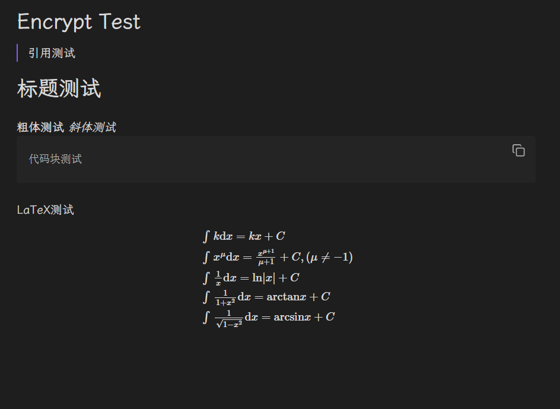
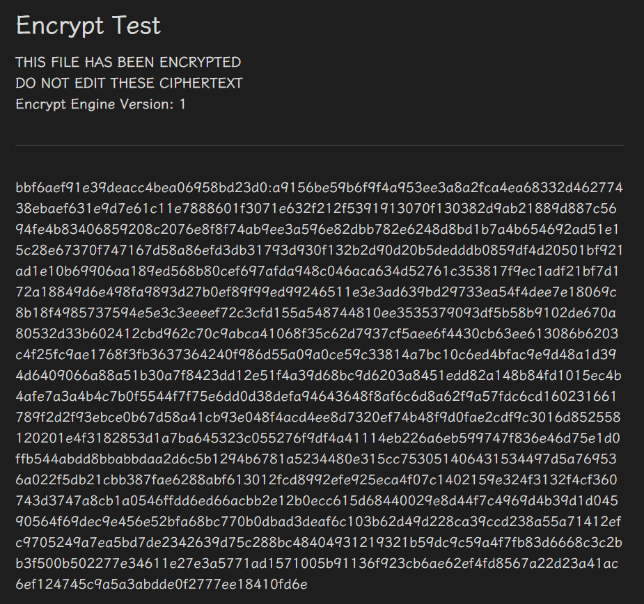
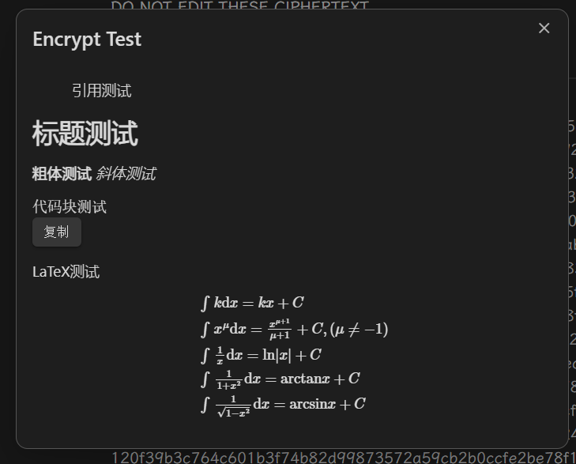

# Obsidian encrypt plugin

## 注意

**永远不要对密文进行编辑更改，这会令你损失笔记**  
**永远不要对密文进行编辑更改，这会令你损失笔记**  
**永远不要对密文进行编辑更改，这会令你损失笔记**  
**永远不要对密文进行编辑更改，这会令你损失笔记**  
**数据无价**

## 关于

用来加密你的笔记的obsidian插件

## 效果展示

源文件：

加密后（密码：123）：

预览：

## 实现

直接对源文本的加密  
将输入的key转换为sha256通过aes-256-cbc算法实现加密 

## 功能

命令列表：  

- Preview file：预览解密后的文件，不对源文件进行操作
- Encrypt file：加密文件，支持重复密码
- Restore Text：解密文件

设置选项：
- Show Confirm Password：在加密中是否需要确认密码 

## todolist

-[ ] 多次重复密文
-[ ] 实现多加密引擎
-[ ] 实现iv隐藏
-[ ] 用其他加密算法(如ChaCha20)实现局部损坏不影响其他部分 

## 其他

欢迎issue与pr
